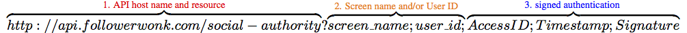

# Anatomy of a Social Authority API Call

Social Authority calls:

1. make an HTTP request to the host name and resource; 
2. specify Twitter user IDs and screen names to search for; and 
3. sign the request with your user information and authentication.

<table class="table-borderless table-striped">
<thead>
	<tr>
		<th>Call element</th>
		<th>Description</th>
	</tr>
</thead>
<tbody>
  <tr>
    <td>API host name and resource</td>
    <td>The host name and resource for all Social Authority calls is <code>api.followerwonk.com/social-authority</code>.</td>
  </tr>
  <tr>
    <td>Screen name and User ID</td>
    <td>To search for accounts, specify either:  <ul><li>a Twitter screen name For example:<code>screen_name=peterbray</code></li><li>a Twitter user ID For example: <code>user_id=24496399</code></li><li>or a mix of each</li></ul>  Use a comma to separate multiple entries in each field.  For example: <code>screen_name=peterbray,randfish,aplusk</code></td>
  </tr>
  <tr>
    <td>Signed authentication</td>
    <td><a href="#signed-auth">Signed authentication</a> requires your Access ID, Timestamp (a Unix timestamp for a future time at which the request will no longer be valid), and Signature (a securely encoded hash of your Access ID, Secret Key, and Timestamp).  For example: <code>AccessID=member-MDczMjM1NGUtN2Y3Ny01OGI0LThkOGUtYzhlYWVlYjcxMTZk; Timestamp=1225138898; Signature=LmXYcPqc%2BkapNKzHzYz2BI4SXfC%3D</code></td>
  </tr>
  <tr>
    <td>? and &#59; </td>
    <td>The question mark <code>?</code> indicates where call parameters begin. A semicolon <code>;</code> separates each parameter.</td>
  </tr>
</tbody>
</table>

## Signed Authentication

Signed authentication requires three query string parameters in every Social Authority API call:

* **AccessID**: obtained when you generate your secure credentials.

* **Timestamp**: a <a rel="nofollow" href="http://www.epochconverter.com/">Unix timestamp</a> (in seconds) indicating how long the request is valid. 

	*Timestamp* should be a time no more than a few minutes ahead. Setting an expiration date too far in the future may pose a security vulnerability, while values set to expire within a few seconds may time out before the call reaches the Mozscape server. An acceptable default is 300 seconds (5 minutes) in the future; our [code samples](/categories/samples) show how different programming languages can handle *Expires*.
	
* **Signature**: an <a rel="nofollow" href="http://tools.ietf.org/html/rfc2104">HMAC-SHA1</a> hash of your Access ID, the Expires parameter, and your [Secret Key](/create-and-manage-your-account).
	
	The secure hash must be base64 encoded then URL-encoded before the Social Authority API accepts the signature as valid. 
	
**Note:** The first step of the Signature hash requires a line break between AccessID and Timestamp. [This PHP code sample from Mozscape](https://github.com/seomoz/SEOmozAPISamples/blob/master/php/signed_authentication_sample.php) provides an example of how to hash and encode your Signature. Automating your signed authentication also saves time when you submit a larger volume of requests.
